# Tarea Ejercicios Capítulo 6

#### Cuéllar Ortega Luis Enrique
#### Arriaga Jacuinde Marco Antonio

**1. Realizamos la mejor selección de un subconjunto, paso a paso hacía adelante y paso a paso hacía atrás en un solo conjunto de datos. Para cada enfoque, obtenemos modelos p+1, que contienen predictores 0,1,2,...,p. Explica:**

- *(a)¿Cuál de los tres modelos con k predictores tiene el menor RSS de entrenamiento?*

**Respuesta:** Con la selección de paso a paso hacía adelante el modelo con k predictores de entre los modelos p-k  que aumentan los predictores en Mk+1, es decir, un predictor más, es el que menor RSS de entrenamiento tiene.

Con la selección de paso a paso hacía atrás el modelo con k predictores de entre los modelos que contienen k-1 predictores en Mk+1.

El modelo con predictores k con el RSS de entrenamiento más bajo es el mejor dentro de todos los demás modelos comparados

- *(b)¿Cuál de los tres modelos con k predictors tiene el menor RSS de prueba?*

**Respuesta:** La selección de subconjuntos con RSS de prueba más pequeño tienene en cuenta más modelos que otros métodos. Pero los otros métodos podrían ajustar mejor los datos por suerte.

- *(c) Verdadero o falso:*

i. Los predictores en el modelo de k-variables identificados por avance gradual son un subconjunto de los predictores en el modelo variable (k+1) identificado por selección progresiva.

**Respuestta:** Verdadero, el modelo con predictores (k+1) se obtiene al aumentar los predictores en el modelo con predictores k con predictor adicional.

ii. Los predictores in el modelo de k-variables identificados por busqueda gradual hacia atrás son un subconjunto de los predictores en el modelo variable (k+1) identificado por selección progresiva hacia atrás.

**Respuesta:** Verdadero, el modelo con k predictores se obtienen removiendo un predictor del modelo con (k+1) predictores.

iii. Los predictores en el modelo de variable k identificados por retroceso paso a paso son un subconjunto de los predictores en el modelo variable (k+1) identificado por selección progresiva hacia adelante.

**Respuesta:** Falso, no hay vinculo directo entre los modelos obtenidos de la selección hacia adelante y hacia atrás.

iv. Los predictores en el modelo de variable k identificados por avance gradual son un subconjunto de los predictores en el modelo variable (k+1) identificado por selección gradual hacia atrás.

**Respuesta:** Falso, no hay vinculo directo entre los modelos obtenidos de la selección hacia adelante y hacia atrás.

v. Los predictores en el modelo de variable k identificados por el mejor subconjunto son un subconjunto de los predictores en el modelo variable (k+1) identificado por la mejor selección de subconjunto.

**Respuesta:** Falso, el modelo con predictores (k+1) se obtiene seleccionando entre todos los modelos posibles con predcitores (k+1), por lo que no necesariamente contiene todos los predictores seleccionados para el modelo de variable k.

**2. Para las partes (a) a (c), indique cuál del i al iv es correcto. Justifica tu respuesta.**

<p>i). Más flexible y, por lo tanto, proporcionará una precisión de predicción mejorada cuando su aumento en el sesgo es menor que su disminución en diferencia.
<p>ii). Más flexible y, por lo tanto, proporcionará una precisión de predicción mejorada cuando su aumento en la varianza es menor que su disminución en sesgo.
<p>iii). Menos flexible y, por lo tanto, dará una precisión de predicción mejorada cuando su aumento en el sesgo es menor que su disminución en diferencia.
<p>iv). Menos flexible y, por lo tanto, dará una precisión de predicción mejorada cuando su aumento en la varianza es menor que su disminución en sesgo.

- *(a) El lasso, en relación con los mínimos cuadrados, es:*

**Respuesta:** El lasso es menos flexible y proporcionará una precisión de predicción mejorada cuando su aumento en el sesgo sea menor que su disminución en la varianza. (iii.)

- *(b) Para la regresión de cresta en relación con los mínimos cuadrados.*

**Respuesta:** Al igual que el lasso, la regresión de cresta es menos flexible y proporcionará una precisión de predicción mejorada cuando su aumento en el sesgo sea menor que su disminución en la varianza. (iii.)

- *(c) Para métodos no lineales relativos a mínimos cuadrados.*

**Respuesta:** Los métodos no lineales son más flexibles y proporcionarán una precisión de predicción mejorada cuando su aumento en la varianza sea menor que su disminución en el sesgo. (ii.)

**3. Suponga que estiamos los coeficientes de regresión en un modelo de regresión lineal minimizando (ecuación del libro) para un valor particular de s. Por partes (a) a (e), indica cuál de i. a través de v. es correcta. Justifica tu respuesta.**

- *(a) A medida qe aumentamos s desde 0, el RSS de captación:*

i. Aumenta inicialmente y luego comienza a disminuir en forma de U invertida.

ii. Disminuye inicialmente y uego comienza a amentar en forma de U.

iii. Aumenta constantemente.

iv. Disminuye constantemente.

v. Permanece constante.

**Respuesta:** Disminiye constantemente, a medida que aumenta s desde 0, todos los betas incrementan desde 0 hasta sus valores de minimos cuadrados estimados. El error de entrenamineto para 0 betas es el maximo y disminuye constantemente hasta ek minimo cuadrado RSS ordinario.

- *(b) Repite (a) para el RSS de prueba*

**Respuesta:** Disminuye inicialmente y luego comienza a aumentar en forma de U, cuando s=0, todas las betas son 0, el modelo es extremadamente simple y tienen un alto RSS de prueba. A medida que va aumentando s, betas tienen valores distintos de 0 y el modelo comienza a ajustarse bien a los datos de prueba, por lo que el RSS de prueba disminuye. Posteriormente, a medida que los beta se acercan a sus valores OLS completos, comienzan a ajustarse en exceso a los datos de entrenamiento, aumento el RSS de prueba.

- *(c) Repite (a) para varianza*

**Respuesta:** Aumenta constantemente, Cuando s=0, el modelo predice eficientemente, es constante y tiene una varianza muy pequeña. Conforme aumenta s, el modelo introduce mas betas y sus valores comienzan a aumentar. En este punto, los valores de las betas se convierten en predictores dependientes de los datos de entrenamiento y esto hace que incremente la varianza.

- *(d) Repite (a) para sesgo (cuadrado)*

**Respuesta:** Disminuye constantemente, cuando s=0, el modelo predice eficientemente una constante y por lo tanto la predicción esta lejos del valor real, el sesgo es grande. Con forme s aumenta, mas betas se vuelven distintos de cero y por lo tanto el modelo continua ajustando mejor lso datos de entrenamiento. Y así, el sesgo disminuye.

- *(e) Repite (a) para el error irreducible*

**Respuesta:** Permanece constante, el error irreducible es independiente del modelo.

**4. Supongamos que estimamos los coeficientes de regresión en un modelo de regresión lineal minimizando para un valor particular de λ. Para las partes (a) a (e), indique cuál del i al iv es correcto. Justifica tu respuesta.**

<p>i). Aumentar inicialmente, y luego eventualmente comenzar a disminuir en forma de U invertida.
<p>ii). Disminuya inicialmente y luego comience a aumentar en forma de U.
<p>iii). Aumentar constantemente.
<p>iv). Disminuir constantemente.
<p>v). Permanecer constante.

   - *(a) A medida que aumentemos λ de 0, el RSS de entrenamiento:* 

**Respuesta:** Aumentar constantemente. A medida que aumentamos λ desde 0, estamos restringiendo los coeficientes βj cada vez más (los coeficientes se desviarán de sus estimaciones de mínimos cuadrados), por lo que el modelo se vuelve cada vez menos flexible, lo que provoca un aumento constante en el entrenamiento de RSS.

   - *(b) Respondan (a) usando el test RSS.*

**Respuesta:** Disminuya inicialmente y luego comience a aumentar en forma de U. A medida que aumentamos λ desde 0, estamos restringiendo los coeficientes βj cada vez más (los coeficientes se desviarán de sus estimaciones de mínimos cuadrados), por lo que el modelo se vuelve cada vez menos flexible, lo que provoca al principio una disminución en la prueba RSS antes de aumentar de nuevo después de eso en forma de U típica.


   - *(c) Respondan (a) usando la varianza.*

**Respuesta:** Disminuir constantemente. A medida que aumentamos λ desde 0, estamos restringiendo los coeficientes βj más y más (los coeficientes se desviarán de sus estimaciones de mínimos cuadrados), por lo que el modelo se vuelve cada vez menos flexible, lo que provoca una disminución constante de la varianza.


   - *(d) Respondan (a) usando sesgo (al cuadrado).*

**Respuesta:** Aumentar constantemente. A medida que aumentamos λ desde 0, restringimos los coeficientes βj (los coeficientes se desviarán de sus estimaciones de mínimos cuadrados), por lo que el modelo se vuelve cada vez menos flexible, lo que provoca un aumento constante en el sesgo.


   - *(e) Respondan (a) usando el error irreducible.*

**Respuesta:** Permanecer constante. Por definición, el error irreducible es independiente del modelo y por lo tanto independiente del valor de λ.

**5. Es bien sabido que la regresión ridge tiende a dar valores de coeficientes similares a las variables correlacionadas,mientras que el lasso puede dar valores de coeficientes bastante diferentes a las variables correlacionadas. Ahora exploraremos esta propiedad en un entorno muy simple**

**Suponga que n=2, p=2, x11 = x12, x21 = x22. Además, suponga que y1 + y2 = 0 y x12 + x22 = 0. Para que la estimación pora el intercepro en minimos cuadrados, regresión ridge, o modelo lasso es cero: Beta0gorrito = 0**

- *(a) Escriba el problema de optimización de regresión de crestas en esta configuración*

**Rspuesta:** 

- *(b) Argumenta que en esta configuración, las estimaciones del coeficiente de ridge satisfacen B1gorrito = B2gorrito*

**Rspuesta:** 

- *(c) Escriba el priblema de optimización de lazo en esta configuración*

**Rspuesta:** 

- *(d) Argumenta que en este contexto, los coeficientes de lazo B1gorrito y B2gorrito no son unicos;enotras palabras, hay muchas posibles soluciones al problema de optimización en (c). Describe estas soluciones.*

**Rspuesta:** 

**6. Ahora exploraremos (6.12) y (6.13) más a fondo.**

   - *(a) Considere (6.12) con p = 1. Para alguna elección de y1 y λ > 0, trace (6.12) en función de β1. Su diagrama debe confirmar que (6.12) se resuelve con (6.14).* 

Para p = 1, (6.12) toma la forma (y − β) 2 + λβ2. Trazamos esta función para y = 2, λ = 2.


```R
y = 2
lambda = 2
betas = seq(-10, 10, 0.1)
func = (y - betas)^2 + lambda * betas^2
plot(betas, func, pch = 20, xlab = "beta", ylab = "Ridge optimization")
est.beta = y/(1 + lambda)
est.func = (y - est.beta)^2 + lambda * est.beta^2
points(est.beta, est.func, col = "red", pch = 4, lwd = 5, cex = est.beta)
```


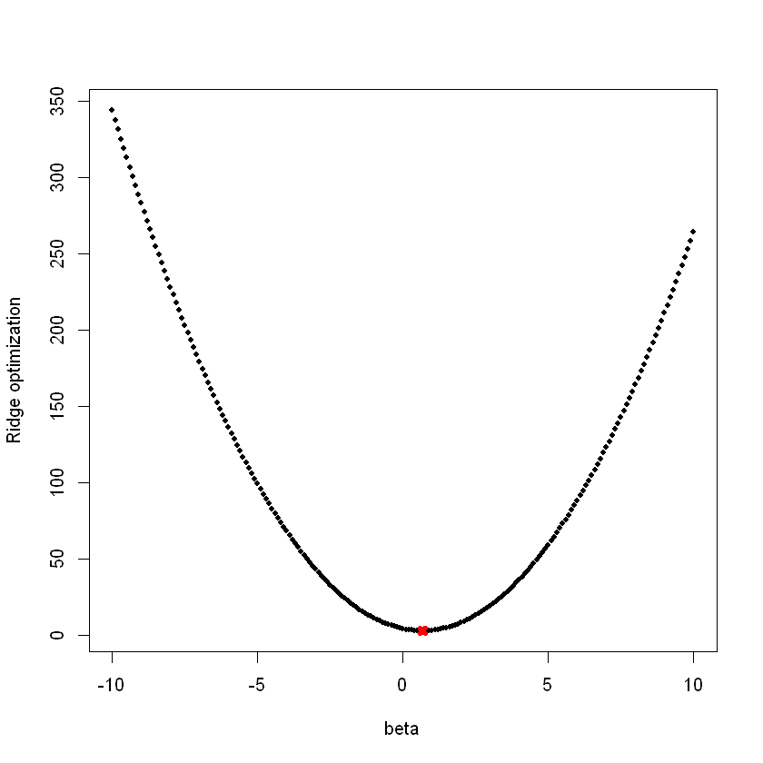


   - *(b) Considera (6.13) con p=1. Para alguna elección de y1 y lambda > 0, imprime (6.13) como un función de B1. Tu grafica debería confirmar que (6.13) se resuelve con (6.15).* 


```R
y = 2
lambda = 2
betas = seq(-3, 3, 0.01)
func = (y - betas)^2 + lambda * abs(betas)
plot(betas, func, pch = 20, xlab = "beta", ylab = "Lasso")
est.beta = y - lambda/2
est.func = (y - est.beta)^2 + lambda * abs(est.beta)
points(est.beta, est.func, col = "red", pch = 4, lwd = 5, cex = est.beta)
```


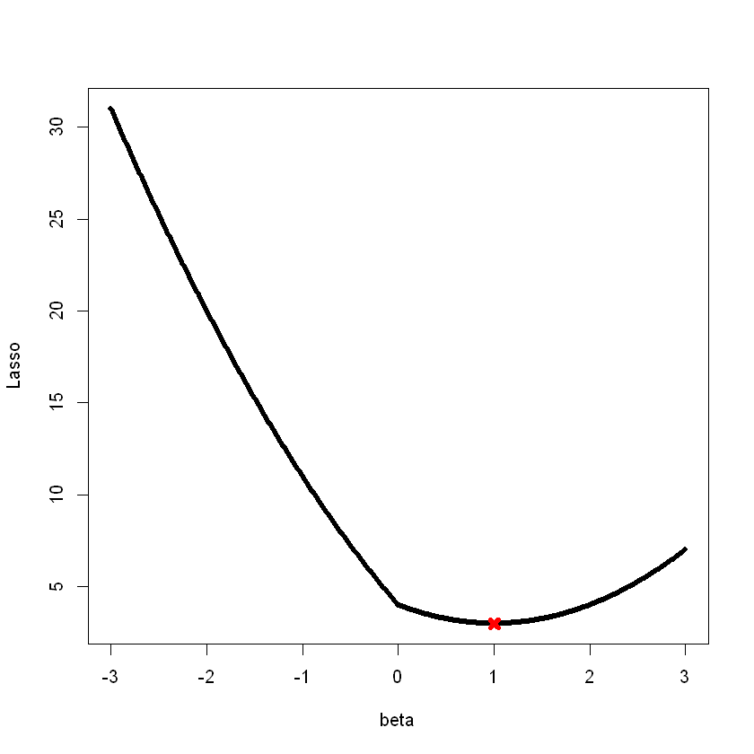


**7. Ahora derivaremos la conexión bayesiana con el lazo y la regresión de cresta discutida en la Sección 6.2.2.**

   - *(a) Escriba la probabilidad de los datos.* 

**Rspuesta:** 

   - *(b) Escriba β en este ajuste.* 

**Rspuesta:** 

   - *(c) Argumenta que la estimación del lazo es el modo para β bajo esta distribución posterior.* 

**Rspuesta:** 

   - *(d) Ahora suponga lo siguiente para β: β1,. . . , βp son independientes y distribuido idénticamente de acuerdo con una distribución normal con media cero y varianza c. Escriba la parte posterior para β en esta configuración.* 

**Rspuesta:** 

   - *(e) Argumenta que la estimación de la regresión de la cresta es tanto el modo como la media de β bajo esta distribución posterior.*

**Rspuesta:** 

**8. En este ejercicio, generaremos datos simulados y luego utilizaremos estos datos para realizar la mejor selección de subconjunto.**

   - *(a) Use la función rnorm () para generar un predictor X de longitud n = 100, así como un vector de ruido de longitud n = 100.*

*i. ¿Hay alguna relación entre el predictor y la respuesta?*


```R
set.seed(24432)
X = rnorm(100)
e = rnorm(100)
```

   - *(b) Genere un vector de respuesta Y de longitud n = 100 de acuerdo con el modelo.*


```R
b0 = 4
b1 = 0.5
b2 = -3
b3 = 1
Y = b0 + b1 * X + b2 * X^2 + b3 * X^3 + e
```

   - *(c) Use la función regsubsets () para realizar la mejor selección de subconjunto para elegir el mejor modelo que contenga los predictores X, X2,. . ., X10. ¿Cuál es el mejor modelo obtenido según Cp, BIC y R2 ajustado? Mostrar algunas parcelas para proporcionar evidencia para su respuesta e informe los coeficientes del mejor modelo obtenido. Tenga en cuenta que deberá usar la función data.frame () para crear un único conjunto de datos que contenga tanto X como Y.*


```R
library(leaps)
data.full = data.frame(y = Y, x = X)
mod.full = regsubsets(y ~ poly(x, 10, raw = T), data = data.full, nvmax = 10)
mod.summary = summary(mod.full)

# Se busca el mejor tamaño de modelo para Cp, BIC, adjr2
which.min(mod.summary$cp)
```

    Warning message:
    "package 'leaps' was built under R version 3.6.3"
    


3


```R
which.min(mod.summary$bic)
```


3


```R
which.max(mod.summary$adjr2)
```


3


```R
reg.summary = summary(mod.full)
par(mfrow = c(2, 2))
plot(reg.summary$cp, xlab = "Number of variables", ylab = "C_p", type = "l")
points(which.min(reg.summary$cp), reg.summary$cp[which.min(reg.summary$cp)], col = "red", cex = 2, pch = 20)
plot(reg.summary$bic, xlab = "Number of variables", ylab = "BIC", type = "l")
points(which.min(reg.summary$bic), reg.summary$bic[which.min(reg.summary$bic)], col = "red", cex = 2, pch = 20)
plot(reg.summary$adjr2, xlab = "Number of variables", ylab = "R^2 ajustado", type = "l")
points(which.max(reg.summary$adjr2), reg.summary$adjr2[which.max(reg.summary$adjr2)], col = "red", cex = 2, pch = 20)
```


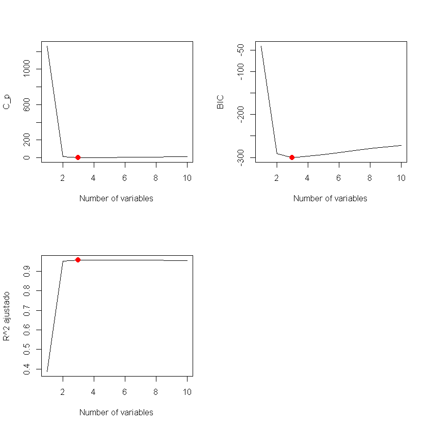


Encontramos que con los criterios Cp, BIC y R2 ajustado, se seleccionan 3, 3 y 3 modelos variables respectivamente.


```R
coefficients(mod.full, id = 3)
```


<style>
.dl-inline {width: auto; margin:0; padding: 0}
.dl-inline>dt, .dl-inline>dd {float: none; width: auto; display: inline-block}
.dl-inline>dt::after {content: ":\0020"; padding-right: .5ex}
.dl-inline>dt:not(:first-of-type) {padding-left: .5ex}
</style><dl class=dl-inline><dt>(Intercept)</dt><dd>3.67651890177551</dd><dt>poly(x, 10, raw = T)1</dt><dd>0.603530924793066</dd><dt>poly(x, 10, raw = T)2</dt><dd>-2.91348109370209</dd><dt>poly(x, 10, raw = T)3</dt><dd>0.939633141025814</dd></dl>


   - *(d) Repita (c), utilizando la selección progresiva hacia adelante y también utilizando la selección progresiva hacia atrás. ¿Cómo se compara tu respuesta con la resultados en (c)?*


```R
mod.fwd = regsubsets(y ~ poly(x, 10, raw = T), data = data.full, nvmax = 10, 
    method = "forward")
mod.bwd = regsubsets(y ~ poly(x, 10, raw = T), data = data.full, nvmax = 10, 
    method = "backward")
fwd.summary = summary(mod.fwd)
bwd.summary = summary(mod.bwd)
which.min(fwd.summary$cp)
```


3


```R
which.min(bwd.summary$cp)
```


5


```R
which.min(fwd.summary$bic)
```


3


```R
which.min(bwd.summary$bic)
```


5


```R
which.max(fwd.summary$adjr2)
```


3


```R
which.max(bwd.summary$adjr2)
```


5


```R
# Graficar las estadísticas
par(mfrow = c(3, 2))
plot(fwd.summary$cp, xlab = "Subset Size", ylab = "Forward Cp", pch = 20, type = "l")
points(3, fwd.summary$cp[3], pch = 4, col = "red", lwd = 7)
plot(bwd.summary$cp, xlab = "Subset Size", ylab = "Backward Cp", pch = 20, type = "l")
points(5, bwd.summary$cp[3], pch = 4, col = "red", lwd = 7)
plot(fwd.summary$bic, xlab = "Subset Size", ylab = "Forward BIC", pch = 20, 
    type = "l")
points(3, fwd.summary$bic[3], pch = 4, col = "red", lwd = 7)
plot(bwd.summary$bic, xlab = "Subset Size", ylab = "Backward BIC", pch = 20, 
    type = "l")
points(5, bwd.summary$bic[3], pch = 4, col = "red", lwd = 7)
plot(fwd.summary$adjr2, xlab = "Subset Size", ylab = "Forward Adjusted R2", 
    pch = 20, type = "l")
points(3, fwd.summary$adjr2[3], pch = 4, col = "red", lwd = 7)
plot(bwd.summary$adjr2, xlab = "Subset Size", ylab = "Backward Adjusted R2", 
    pch = 20, type = "l")
points(5, bwd.summary$adjr2[4], pch = 4, col = "red", lwd = 7)
```


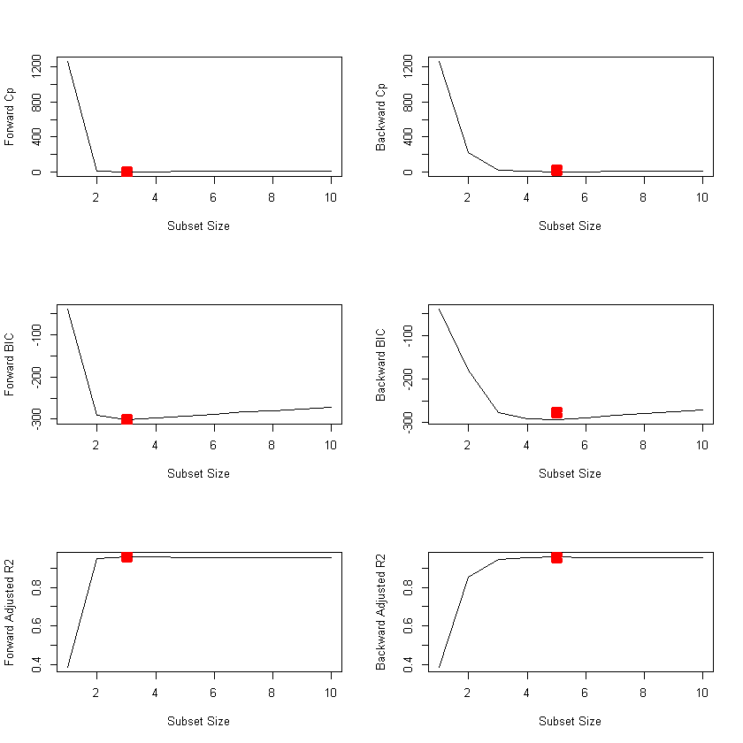


Vemos que las estadísticas fwd seleccionan 3 modelos variables mientras que los bwd seleccionan 5. Ahora los coeficientes:


```R
coefficients(mod.fwd, id = 3)
```


<style>
.dl-inline {width: auto; margin:0; padding: 0}
.dl-inline>dt, .dl-inline>dd {float: none; width: auto; display: inline-block}
.dl-inline>dt::after {content: ":\0020"; padding-right: .5ex}
.dl-inline>dt:not(:first-of-type) {padding-left: .5ex}
</style><dl class=dl-inline><dt>(Intercept)</dt><dd>3.67651890177551</dd><dt>poly(x, 10, raw = T)1</dt><dd>0.603530924793066</dd><dt>poly(x, 10, raw = T)2</dt><dd>-2.91348109370209</dd><dt>poly(x, 10, raw = T)3</dt><dd>0.939633141025815</dd></dl>


```R
coefficients(mod.bwd, id = 5)
```


<style>
.dl-inline {width: auto; margin:0; padding: 0}
.dl-inline>dt, .dl-inline>dd {float: none; width: auto; display: inline-block}
.dl-inline>dt::after {content: ":\0020"; padding-right: .5ex}
.dl-inline>dt:not(:first-of-type) {padding-left: .5ex}
</style><dl class=dl-inline><dt>(Intercept)</dt><dd>3.72532597615409</dd><dt>poly(x, 10, raw = T)1</dt><dd>0.964004819406533</dd><dt>poly(x, 10, raw = T)2</dt><dd>-2.98627061584675</dd><dt>poly(x, 10, raw = T)5</dt><dd>0.650468139100316</dd><dt>poly(x, 10, raw = T)7</dt><dd>-0.153833572948286</dd><dt>poly(x, 10, raw = T)9</dt><dd>0.0109689187770399</dd></dl>


En fwd se escoje x1, x2 y x3 mientras que en bwd se escoje x1, x2 y hasta x5 y x7.

   - *(e) Ahora ajuste un modelo de lazo a los datos simulados, nuevamente usando X, X2,. . . , X10 como predictores. Utilice la validación cruzada para seleccionar el valor óptimo de λ. Cree gráficos del error de validación cruzada en función de λ. Informe los coeficientes estimados resultantes.*


```R
library(glmnet)
xmat = model.matrix(y ~ poly(x, 10, raw = T), data = data.full)[, -1]
mod.lasso = cv.glmnet(xmat, Y, alpha = 1)
best.lambda = mod.lasso$lambda.min
best.lambda
```

    Warning message:
    "package 'glmnet' was built under R version 3.6.3"
    Loading required package: Matrix
    
    Loaded glmnet 3.0-2
    
    
    


0.0418952412812953


```R
plot(mod.lasso)
```


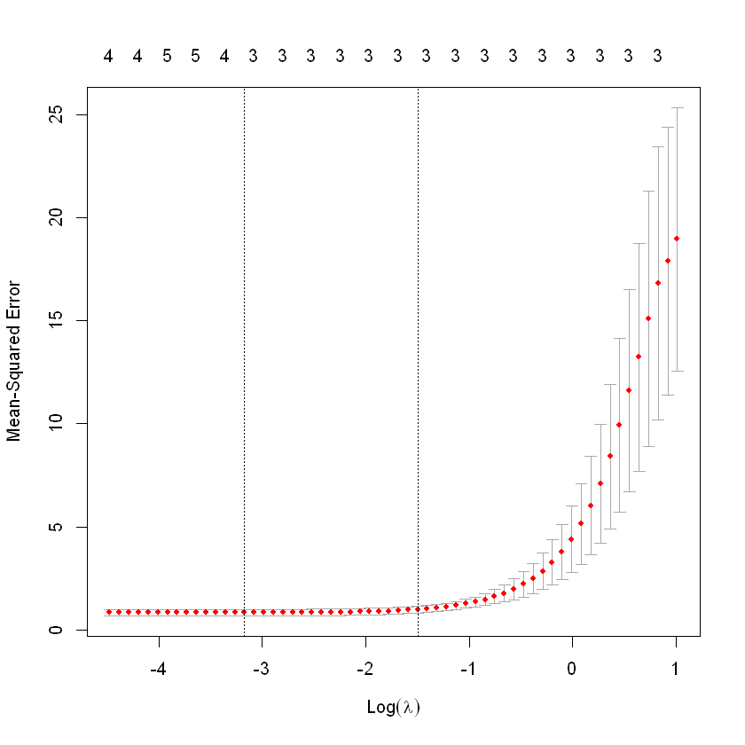


```R
# Se ajusta el modelo usando la mejor almbda
best.model = glmnet(xmat, Y, alpha = 1)
predict(best.model, s = best.lambda, type = "coefficients")
```


    11 x 1 sparse Matrix of class "dgCMatrix"
                                    1
    (Intercept)             3.6376371
    poly(x, 10, raw = T)1   0.5997765
    poly(x, 10, raw = T)2  -2.8673840
    poly(x, 10, raw = T)3   0.9224362
    poly(x, 10, raw = T)4   .        
    poly(x, 10, raw = T)5   .        
    poly(x, 10, raw = T)6   .        
    poly(x, 10, raw = T)7   .        
    poly(x, 10, raw = T)8   .        
    poly(x, 10, raw = T)9   .        
    poly(x, 10, raw = T)10  .        


Lasso al igual escoje x1, x2 y x3.

   - *(f) Ajuste un modelo PLS en el conjunto de entrenamiento, con M elegida por validación cruzada. Informe el error de prueba obtenido, junto con el valor de M seleccionado por validación cruzada.*


```R
#Se crea una nueva beta con valor constante.
b9 = 9
Y = b0 + b9 * X^7 + e
# Predicción con regsubsets
data.full = data.frame(y = Y, x = X)
mod.full = regsubsets(y ~ poly(x, 10, raw = T), data = data.full, nvmax = 10)
mod.summary = summary(mod.full)

# Find the model size for best cp, BIC and adjr2
which.min(mod.summary$cp)
```


2


```R
which.min(mod.summary$bic)
```


1


```R
which.max(mod.summary$adjr2)
```


2


```R
coefficients(mod.full, id = 1)
```


<style>
.dl-inline {width: auto; margin:0; padding: 0}
.dl-inline>dt, .dl-inline>dd {float: none; width: auto; display: inline-block}
.dl-inline>dt::after {content: ":\0020"; padding-right: .5ex}
.dl-inline>dt:not(:first-of-type) {padding-left: .5ex}
</style><dl class=dl-inline><dt>(Intercept)</dt><dd>3.75248515372162</dd><dt>poly(x, 10, raw = T)7</dt><dd>8.99965768970608</dd></dl>


```R
coefficients(mod.full, id = 2)
```


<style>
.dl-inline {width: auto; margin:0; padding: 0}
.dl-inline>dt, .dl-inline>dd {float: none; width: auto; display: inline-block}
.dl-inline>dt::after {content: ":\0020"; padding-right: .5ex}
.dl-inline>dt:not(:first-of-type) {padding-left: .5ex}
</style><dl class=dl-inline><dt>(Intercept)</dt><dd>3.72971045122486</dd><dt>poly(x, 10, raw = T)7</dt><dd>8.9968825500971</dd><dt>poly(x, 10, raw = T)10</dt><dd>0.000139340422208256</dd></dl>


Se elige el modelo de 1 variable ya que es más preciso con coeficientes coincidentes y porque el otro elecciona variables adicionales.


```R
xmat = model.matrix(y ~ poly(x, 10, raw = T), data = data.full)[, -1]
mod.lasso = cv.glmnet(xmat, Y, alpha = 1)
best.lambda = mod.lasso$lambda.min
best.lambda
```


36.8880593314387


```R
best.model = glmnet(xmat, Y, alpha = 1)
predict(best.model, s = best.lambda, type = "coefficients")
```


    11 x 1 sparse Matrix of class "dgCMatrix"
                                  1
    (Intercept)            6.539139
    poly(x, 10, raw = T)1  .       
    poly(x, 10, raw = T)2  .       
    poly(x, 10, raw = T)3  .       
    poly(x, 10, raw = T)4  .       
    poly(x, 10, raw = T)5  .       
    poly(x, 10, raw = T)6  .       
    poly(x, 10, raw = T)7  8.737313
    poly(x, 10, raw = T)8  .       
    poly(x, 10, raw = T)9  .       
    poly(x, 10, raw = T)10 .       


Lasso igual escoge el de una variable aunque el intercept varía entre uno y otro.


```R

```

**9. En este ejercicio, vamos a predecir el numero de aplicaciones recibidas usando las otras variables con los datos de college**

- *(a) Divida el conjunto de datos en un conjunto de entrenamiento y un ocnjunto de prueba*


```R
suppressMessages(library('ISLR'))
suppressMessages(library('glmnet'))
set.seed(15)
sum(is.na(College))
```


0


```R
data(College)
entrenamiento.size = dim(College)[1] / 2
entrenamiento = sample(1:dim(College)[1], entrenamiento.size)
prueba = -entrenamiento
College.entrenamiento = College[entrenamiento, ]
College.prueba= College[prueba, ]
```

- *(b) Ajuste un modelo lineal usando minimos cuadrados en el conjunto de entrenamiento e informe el error de prueba obtenido*


```R
fit.lm = lm(Apps ~ ., data = College.entrenamiento)
pred.lm = predict(fit.lm, College.prueba)
mean((pred.lm - College.prueba$Apps)^2)
```


1404393.94893391


- *(c) Ajuste un modelo de regresión de ridge en el set de entrenamiento, con el lamba elegido de validación cruzada. Reporte el error de prueba obtenido*


```R
entrenamiento.mat = model.matrix(Apps~., data=College.entrenamiento)
prueba.mat = model.matrix(Apps~., data=College.prueba)
grid = 10 ^ seq(4, -2, length=100)
cv.ridge = cv.glmnet(entrenamiento.mat, College.entrenamiento$Apps, alpha=0, lambda=grid, thresh=1e-12)
bestlam.ridge = cv.ridge$lambda.min
bestlam.ridge

```


0.01


```R
pred.ridge = predict(cv.ridge, s = bestlam.ridge, newx = prueba.mat)
mean((pred.ridge - College.prueba$Apps)^2)
```


1404355.90601873


- *(d) Ajuste en modelo de lasso enel set de entrenamiento, con la lamda elegida por validación cruzada. Reporte el error de prueba obtenido, junto con el número de estimaciones de coeficientes distintos de cero*


```R
fit.lasso = glmnet(entrenamiento.mat, College.entrenamiento$Apps, alpha = 1, lambda = grid, thresh = 1e-12)
cv.lasso = cv.glmnet(entrenamiento.mat, College.entrenamiento$Apps, alpha = 1, lambda = grid, thresh = 1e-12)
bestlam.lasso = cv.lasso$lambda.min
bestlam.lasso
```


0.01


```R
pred.lasso = predict(fit.lasso, s = bestlam.lasso, newx = prueba.mat)
mean((pred.lasso - College.prueba$Apps)^2)
```


1404334.94027117


```R
predict(fit.lasso, s = bestlam.lasso, type = "coefficients")
```


    19 x 1 sparse Matrix of class "dgCMatrix"
                            1
    (Intercept) -6.401409e+02
    (Intercept)  .           
    PrivateYes  -3.253039e+02
    Accept       1.830936e+00
    Enroll      -1.583955e+00
    Top10perc    5.689236e+01
    Top25perc   -2.331336e+01
    F.Undergrad  1.216688e-01
    P.Undergrad  4.786625e-03
    Outstate    -8.001898e-02
    Room.Board   9.720231e-02
    Books        3.068859e-01
    Personal     5.275504e-02
    PhD         -9.044248e+00
    Terminal    -1.392696e-01
    S.F.Ratio    2.030418e+01
    perc.alumni  1.718712e+00
    Expend       5.967794e-02
    Grad.Rate    9.704188e+00


- *(e) Ajuste un modelo de PCR en el set de entrenamiento, con la M elegida por validación cruzada. Reporte el error de prueba obtenido, junto con el valor de la M seleccionada por validación cruzada*


```R
install.packages("pls")
```

    Installing package into 'C:/Users/LuisEnrique/Documents/R/win-library/3.6'
    (as 'lib' is unspecified)
    
    

    package 'pls' successfully unpacked and MD5 sums checked
    
    The downloaded binary packages are in
    	C:\Users\LuisEnrique\AppData\Local\Temp\Rtmp2dJAxT\downloaded_packages
    


```R
suppressMessages(library('pls'))
```

    Warning message:
    "package 'pls' was built under R version 3.6.3"
    


```R
fit.pcr = pcr(Apps ~ ., data = College.entrenamiento, scale = TRUE, validation = "CV")
validationplot(fit.pcr, val.type = "MSEP")
```


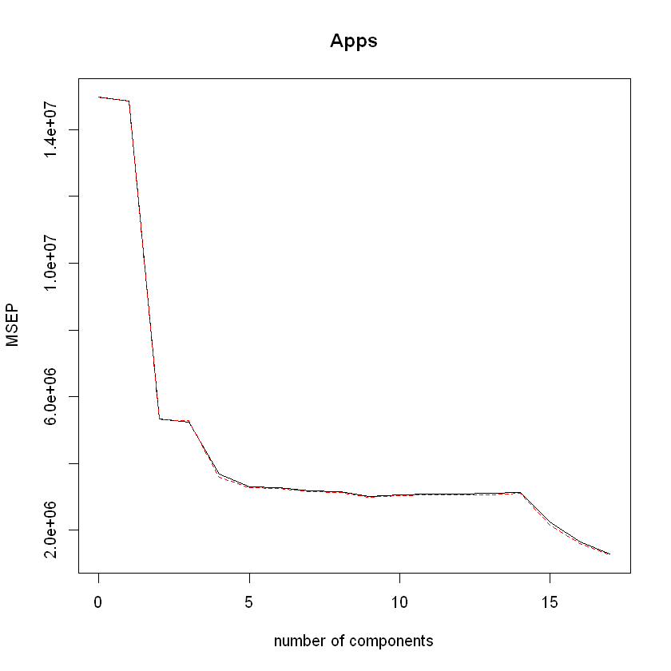


```R
pred.pcr = predict(fit.pcr, College.prueba, ncomp = 10)
mean((pred.pcr - College.prueba$Apps)^2)
```


1942749.55086353


- *(f) Ajuste un mdelo PLS en el set de entrenamiento, con el M elegido por validación cruzada. Reporte el error de prueba obtenido, junto con el valor de M seleccionado por validación cruzada*


```R
fit.pls = plsr(Apps ~ ., data = College.entrenamiento, scale = TRUE, validation = "CV")
validationplot(fit.pls, val.type = "MSEP")
```


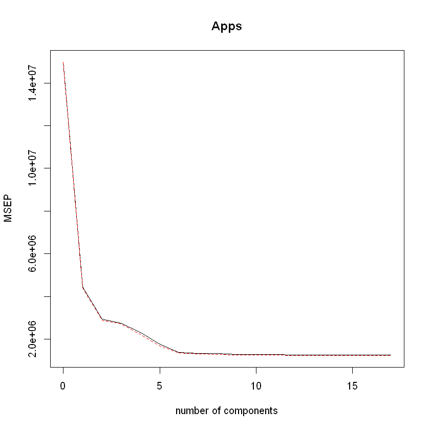


```R
pred.pls = predict(fit.pls, College.prueba, ncomp = 10)
mean((pred.pls - College.prueba$Apps)^2)
```


1406322.47608555


- *(g) Comenta sobre los resutados obtenidos ¿Con qué precisión podemos predecir el número de solicitudes universitarias recibidas? ¿Hay mucha diferencia entre os errores de prueba resultantes de estos cinco enfoques?*


```R
test.avg = mean(College.prueba$Apps)
lm.test.r2 = 1 - mean((College.prueba$Apps - pred.lm)^2) /mean((College.prueba$Apps - test.avg)^2)
ridge.test.r2 = 1 - mean((College.prueba$Apps - pred.ridge)^2) /mean((College.prueba$Apps - test.avg)^2)
lasso.test.r2 = 1 - mean((College.prueba$Apps - pred.lasso)^2) /mean((College.prueba$Apps - test.avg)^2)
pcr.test.r2 = 1 - mean((College.prueba$Apps - pred.pcr)^2) /mean((College.prueba$Apps - test.avg)^2)
pls.test.r2 = 1 - mean((College.prueba$Apps - pred.pls)^2) /mean((College.prueba$Apps - test.avg)^2)
barplot(c(lm.test.r2, ridge.test.r2, lasso.test.r2, pcr.test.r2, pls.test.r2), col="red", names.arg=c("OLS", "Ridge", "Lasso", "PCR", "PLS"), main="Test R-squared")
```


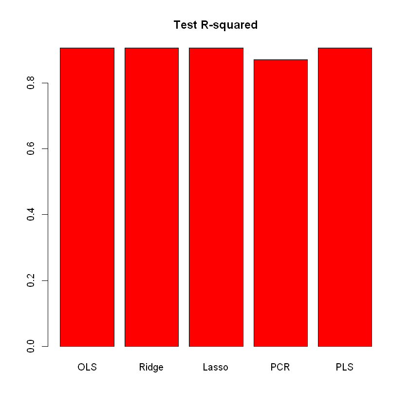


**10. Hemos visto que a medida que aumenta el número de características utilizadas en un modelo, el error de entrenamiento necesariamente disminuirá, pero el error de prueba puede no hacerlo. Ahora exploraremos esto en un conjunto de datos simulado.**

   - *(a) Genere un conjunto de datos con p = 20 características, n = 1,000 observaciones, y un vector de respuesta cuantitativa asociado generado segun el modelo.*


```R
set.seed(243642)
p = 20
n = 1000
x = matrix(rnorm(n * p), n, p)
B = rnorm(p)
B[3] = 0
B[4] = 0
B[9] = 0
B[19] = 0
B[10] = 0
e = rnorm(p)
y = x %*% B + e
```

   - *(b) Divida su conjunto de datos en un conjunto de entrenamiento que contenga 100 observaciones y un conjunto de prueba que contenga 900 observaciones.*


```R
train = sample(seq(1000), 100, replace = FALSE)
y.train = y[train, ]
y.test = y[-train, ]
x.train = x[train, ]
x.test = x[-train, ]
```

   - *(c) Realice la mejor selección de subconjunto en el conjunto de entrenamiento y trace el conjunto de entrenamiento MSE asociado con el mejor modelo de cada tamaño.*


```R
regfit.full = regsubsets(y ~ ., data = data.frame(x = x.train, y = y.train), 
    nvmax = p)
val.errors = rep(NA, p)
x_cols = colnames(x, do.NULL = FALSE, prefix = "x.")
for (i in 1:p) {
    coefi = coef(regfit.full, id = i)
    pred = as.matrix(x.train[, x_cols %in% names(coefi)]) %*% coefi[names(coefi) %in% 
        x_cols]
    val.errors[i] = mean((y.train - pred)^2)
}
plot(val.errors, ylab = "Entrenamiento MSE", pch = 19, type = "b")
```


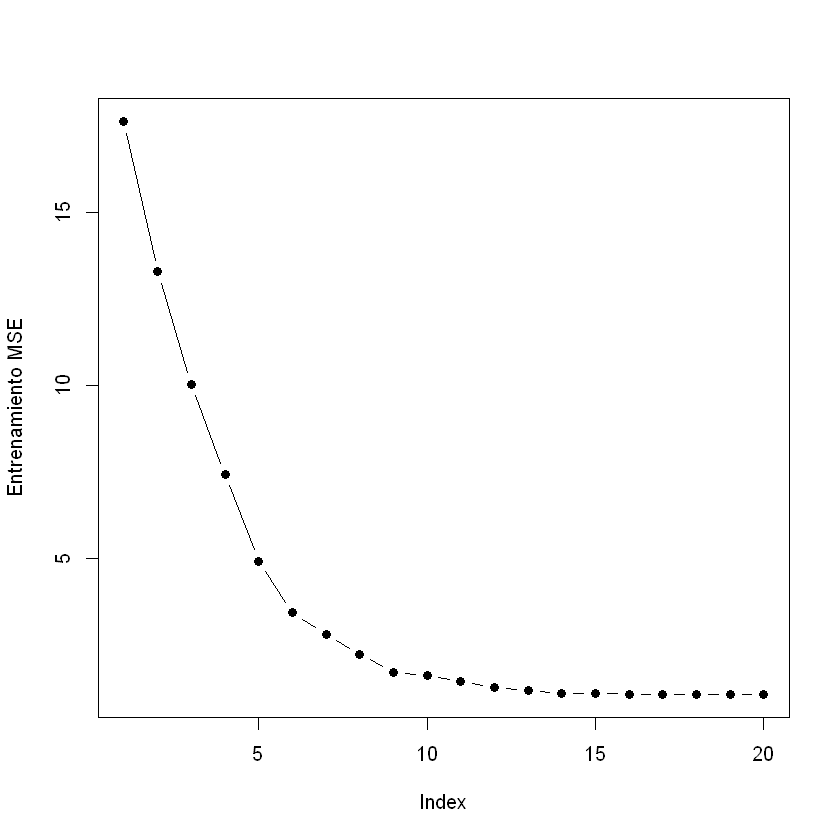


   - *(d) Trace el conjunto de prueba MSE asociado con el mejor modelo de cada tamaño.*


```R
val.errors = rep(NA, p)
for (i in 1:p) {
    coefi = coef(regfit.full, id = i)
    pred = as.matrix(x.test[, x_cols %in% names(coefi)]) %*% coefi[names(coefi) %in% 
        x_cols]
    val.errors[i] = mean((y.test - pred)^2)
}
plot(val.errors, ylab = "Prueba MSE", pch = 19, type = "b")
```


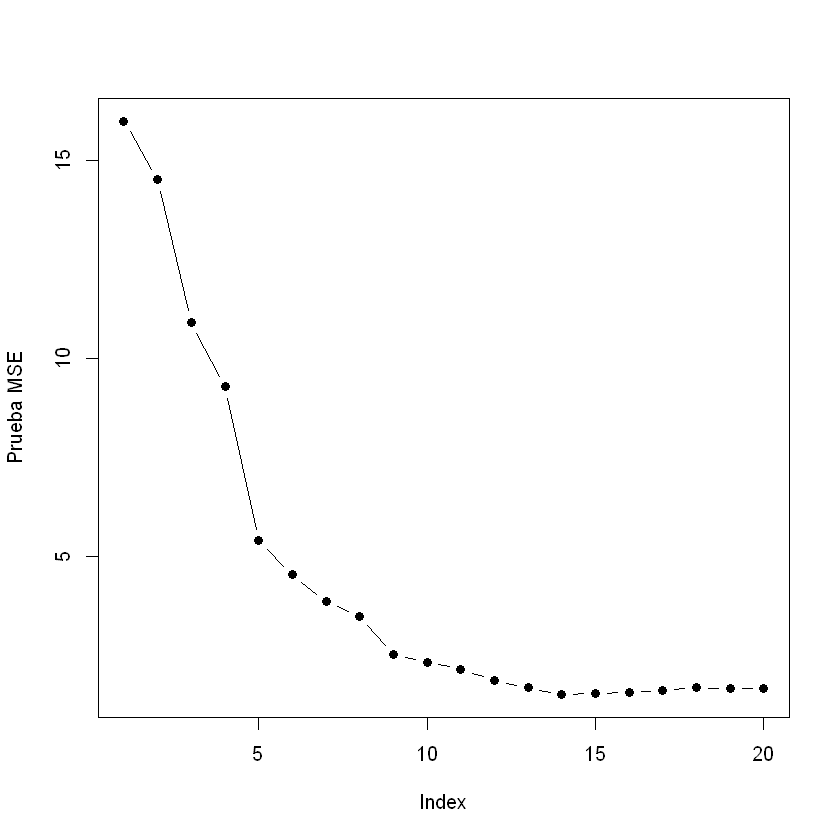


   - *(e) ¿Para qué tamaño de modelo el conjunto de prueba MSE toma su valor mínimo? Comenta tus resultados. Si toma su valor mínimo para un modelo que contiene solo una intercepción o un modelo que contiene todas las características, juegue con la forma en que está generando los datos en (a) hasta llegar a un escenario en el que la prueba establecer MSE se minimiza para un tamaño de modelo intermedio.*


```R
which.min(val.errors)
```


14


El modelo de 14 variables tiene la prueba MSE más pequeña.

   - *(f) ¿Cómo se compara el modelo en el que se minimiza el conjunto de pruebas MSE con el modelo verdadero utilizado para generar los datos? Comente sobre los valores de los coeficientes.*


```R
coef(regfit.full, id = 14)
```


<style>
.dl-inline {width: auto; margin:0; padding: 0}
.dl-inline>dt, .dl-inline>dd {float: none; width: auto; display: inline-block}
.dl-inline>dt::after {content: ":\0020"; padding-right: .5ex}
.dl-inline>dt:not(:first-of-type) {padding-left: .5ex}
</style><dl class=dl-inline><dt>(Intercept)</dt><dd>-0.217868628639689</dd><dt>x.1</dt><dd>0.424414738628298</dd><dt>x.2</dt><dd>-2.08195197395362</dd><dt>x.6</dt><dd>-0.369460139458655</dd><dt>x.7</dt><dd>-1.48055306130987</dd><dt>x.8</dt><dd>-1.62303520397763</dd><dt>x.11</dt><dd>-0.500624408232906</dd><dt>x.12</dt><dd>-1.86480929279657</dd><dt>x.13</dt><dd>-0.395333348613426</dd><dt>x.14</dt><dd>0.760305503498593</dd><dt>x.15</dt><dd>3.11851393530623</dd><dt>x.16</dt><dd>-0.337469431516375</dd><dt>x.17</dt><dd>-1.19224741638902</dd><dt>x.18</dt><dd>0.690081044683783</dd><dt>x.20</dt><dd>0.667908896157027</dd></dl>


La mayoría de coeficientes cuadra con cero.

   - *(g) Cree una gráfica de una función dada que muestre un rango de valores de r, donde βrj es la estimación del coeficiente j para el mejor modelo que contiene los coeficientes r. Comenta sobre lo que observas. ¿Cómo se compara esto con la trama MSE de prueba de (d)?*


```R
val.errors = rep(NA, p)
a = rep(NA, p)
f = rep(NA, p)
for (i in 1:p) {
    coefi = coef(regfit.full, id = i)
    a[i] = length(coefi) - 1
    f[i] = sqrt(sum((B[x_cols %in% names(coefi)] - coefi[names(coefi) %in% x_cols])^2) + 
        sum(B[!(x_cols %in% names(coefi))])^2) #función dada
}
plot(x = a, y = f, xlab = "coeficientes", ylab = "error entre estimado y coeficientes reales")
```


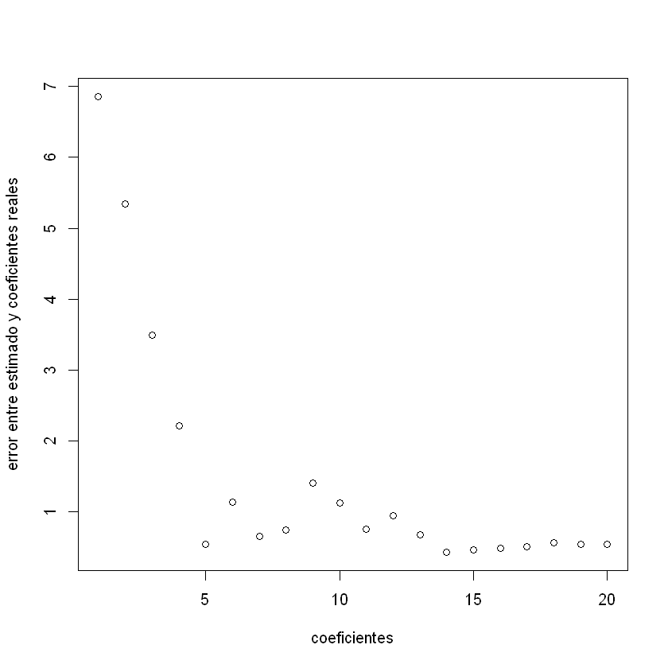


```R
which.min(f)
```


14


El modelo con 9 coeficientes (10 con intersección) minimiza el error entre los coeficientes estimados y reales. El error de prueba se minimiza con el modelo de 14 variables. Un mejor ajuste de los coeficientes reales medidos aquí no quiere decir que el modelo tendrá una prueba MSE más baja.

**11. Ahora intentaremos predecir la tasa de criminalidad per capita en el set de datos de Boston.**

- *(a) Pruebe algunos de los métodos de regresión explorados en este capítulo, como la mejor selección de subconjuntos, lasso, ridge y PCR. Presente y discuta los resultados de los enfoques que considere.*


```R
set.seed(11)
library(MASS)
data(Boston)
library(leaps)
```

**Selección del mejor subconjunto**


```R
predict.regsubsets = function(object, newdata, id, ...) {
    form = as.formula(object$call[[2]])
    mat = model.matrix(form, newdata)
    coefi = coef(object, id = id)
    xvars = names(coefi)
    mat[, xvars] %*% coefi
}

k = 10
folds = sample(1:k, nrow(Boston), replace = TRUE)
cv.errors = matrix(NA, k, 13, dimnames = list(NULL, paste(1:13)))
for (j in 1:k) {
    best.fit = regsubsets(crim ~ ., data = Boston[folds != j, ], nvmax = 13)
    for (i in 1:13) {
        pred = predict(best.fit, Boston[folds == j, ], id = i)
        cv.errors[j, i] = mean((Boston$crim[folds == j] - pred)^2)
    }
}
mean.cv.errors = apply(cv.errors, 2, mean)
plot(mean.cv.errors, type = "b", xlab = "Number of variables", ylab = "CV error")
```


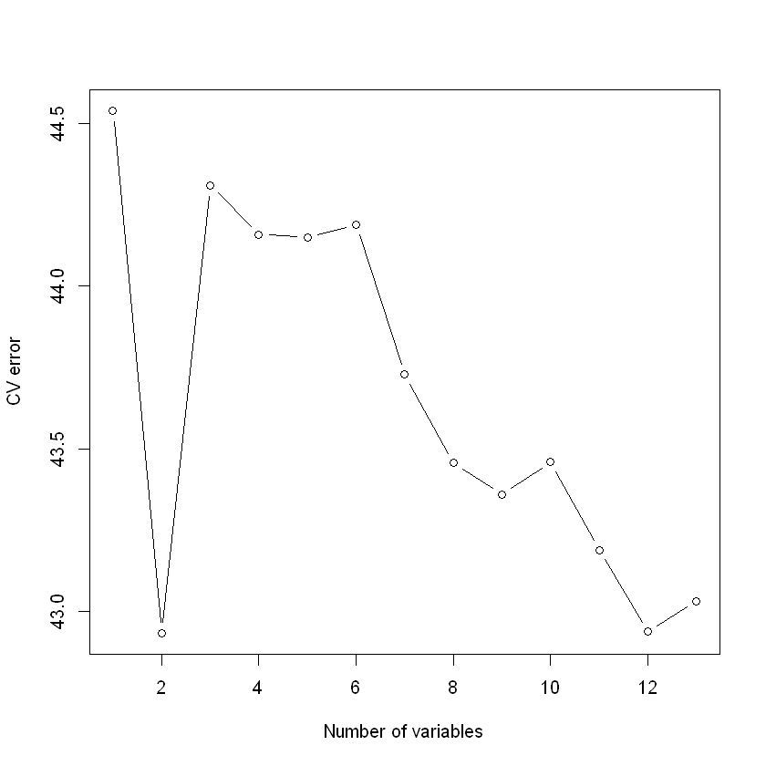


Vemos que la validación crizada selecciona el modelo de 12 variables. Tiene un MSE igual a 41.0345657

**Lasso**


```R
x = model.matrix(crim ~ ., Boston)[, -1]
y = Boston$crim
cv.out = cv.glmnet(x, y, alpha = 1, type.measure = "mse")
plot(cv.out)
```


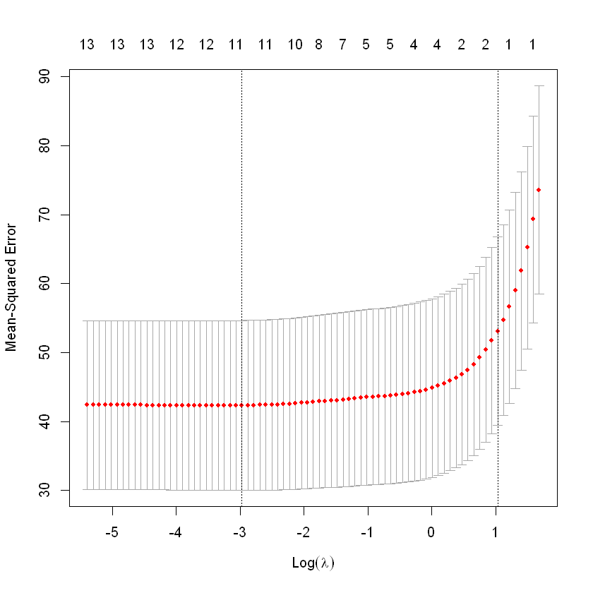


Aquí la validación cruzada selecciona una lamda igual a 0.0467489 y el MSE igual a 42.1343


```R
cv.out = cv.glmnet(x, y, alpha = 0, type.measure = "mse")
plot(cv.out)
```


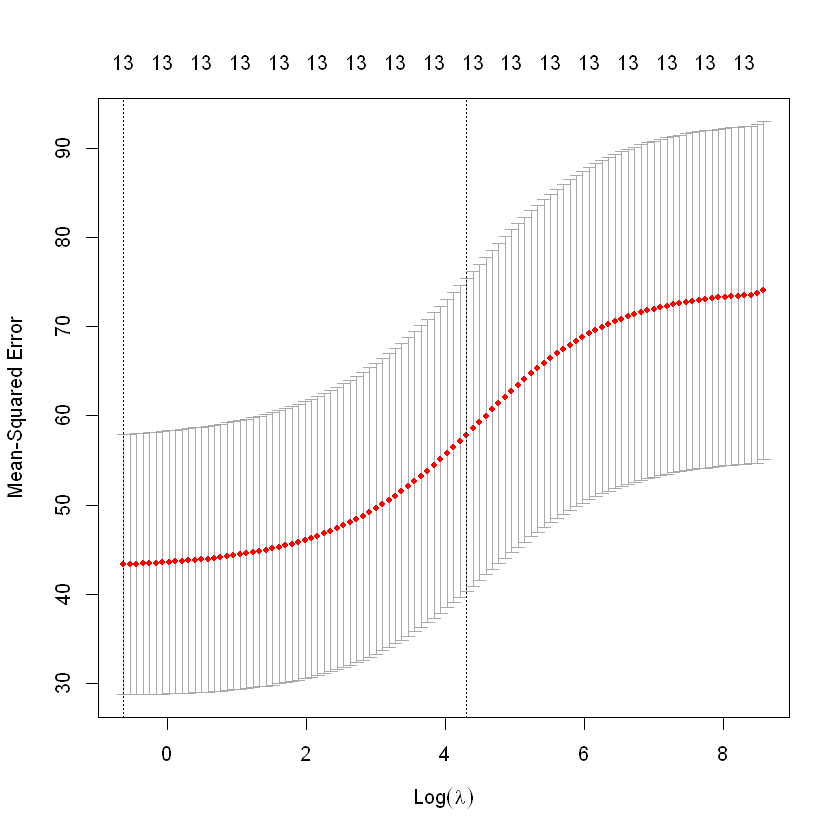


Aquí la validacion cruzada selecciona una lamda igual a 0.53749 y un MSE igual a 42.98345

**PCR**


```R
pcr.fit <- pcr(crim ~ ., data = Boston, scale = TRUE, validation = "CV")
summary(pcr.fit)
```

    Data: 	X dimension: 506 13 
    	Y dimension: 506 1
    Fit method: svdpc
    Number of components considered: 13
    
    VALIDATION: RMSEP
    Cross-validated using 10 random segments.
           (Intercept)  1 comps  2 comps  3 comps  4 comps  5 comps  6 comps
    CV            8.61    7.209    7.203    6.764     6.75    6.780    6.822
    adjCV         8.61    7.206    7.200    6.759     6.74    6.775    6.814
           7 comps  8 comps  9 comps  10 comps  11 comps  12 comps  13 comps
    CV       6.817    6.698    6.728     6.729     6.720     6.687     6.622
    adjCV    6.808    6.689    6.717     6.716     6.708     6.673     6.608
    
    TRAINING: % variance explained
          1 comps  2 comps  3 comps  4 comps  5 comps  6 comps  7 comps  8 comps
    X       47.70    60.36    69.67    76.45    82.99    88.00    91.14    93.45
    crim    30.69    30.87    39.27    39.61    39.61    39.86    40.14    42.47
          9 comps  10 comps  11 comps  12 comps  13 comps
    X       95.40     97.04     98.46     99.52     100.0
    crim    42.55     42.78     43.04     44.13      45.4
    


```R
validationplot(pcr.fit, val.type = "MSEP")
```


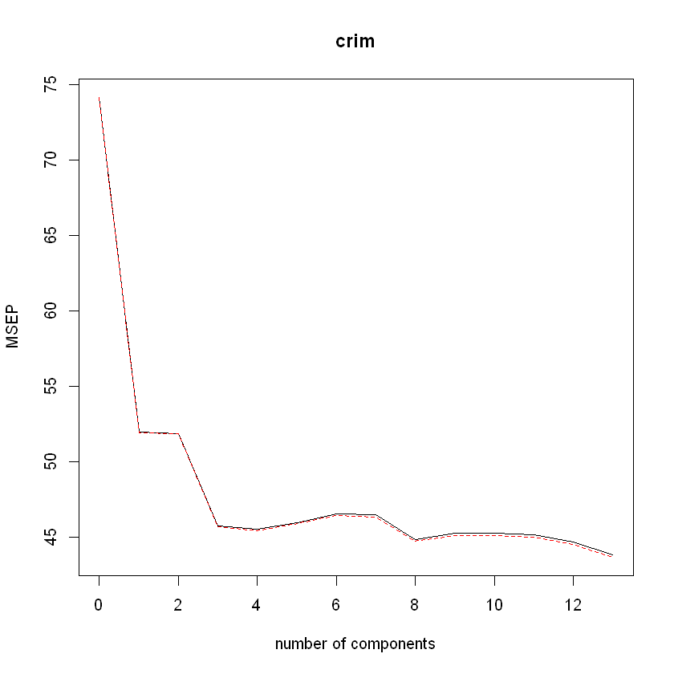


Aquí la validación cruzada selecciono la M igual a 14, el MSE de test igual a 45.6935

- *Proponga un modelo (o conjunto de modelos) que parezca funcionar bien en este set de datos y justifique su respuesta. Asegúrese de evaluar el error del conjunto de validación, la validación cruzada u otra alternativa razonable, en lugar de utilizar el error de entrenamiento.*

Como se observa en las respuestas anteriores el modelo con el menor error de validación cruzada es el elegido por el método de slección de sets.

- *(c) ¿Su modelo elegido involucra todas las características del set de datos? ¿Por qué o por qué no?*

No, el modelo elegido por el mejor método de selección de subconjuntos solo tiene 13 presdictores.
